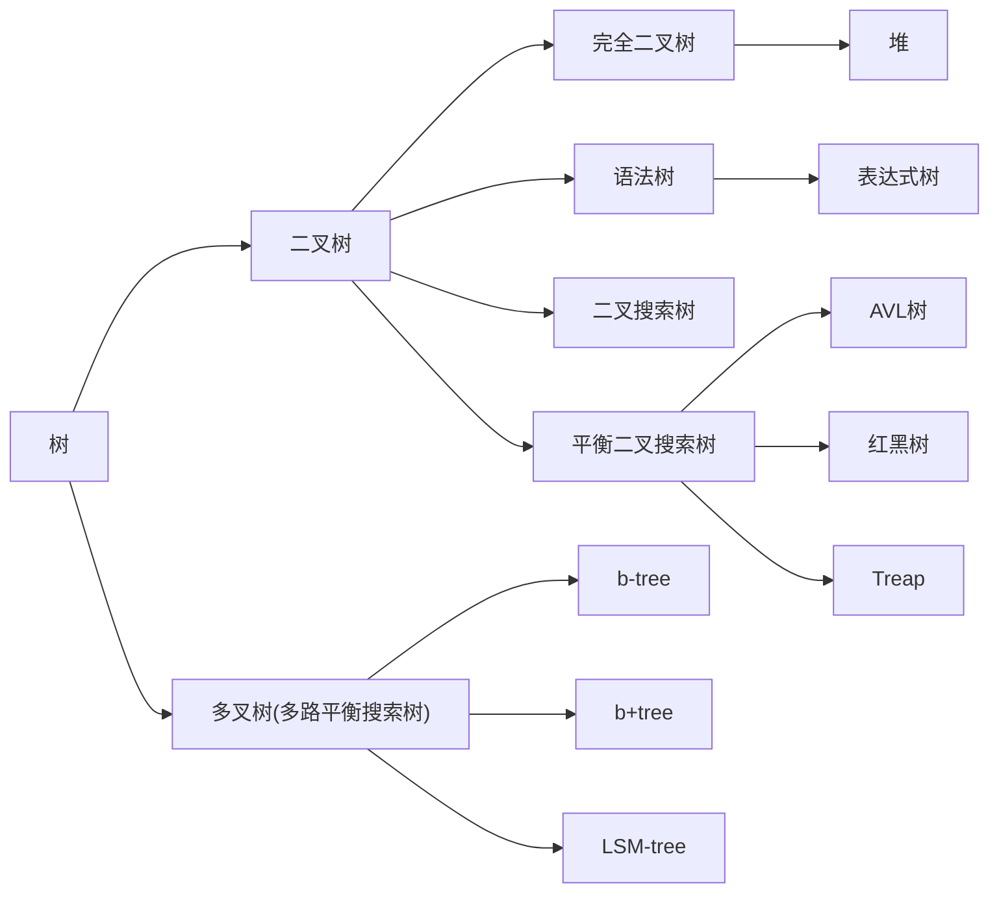

+ 术语：
+ 实现：
	+ 二叉树：两个指针
	+ 多叉树：一个结点表示最左边的儿子，另一个结点表示这个结点右边的兄弟。
	


## 二叉搜索树

+ 二叉搜索树：一种偏序树，每个结点的左子树的所有项“小于”该结点，右子树的所有项“大于”该结点
	+ 可能退化成链导致复杂度爆炸。

## 堆

```cpp
// 堆算法（线性表实现）
// 放：放在表的末尾，然后向上浮动
// 取：将表的末尾放在根，然后向下沉降
//  对于每个结点，先找到两个孩子中偏序关系更弱的，然后和其进行比较交换
#include <cassert>
#include <functional>
#include <iostream>
#include <queue>
#include <random>
#include <vector>

template <typename T, typename Compare = std::less<T>> class Heap {
private:
public:
  explicit Heap() : data_{}, size_(0), cmp_{Compare()} { data_.push_back({}); }
  void Push(T value) {
    ++size_;
    data_.push_back(std::move(value));
    std::size_t now = size_, next;
    // 自底向上浮动, next < now
    while (now > 1) {
      next = now >> 1;
      if (cmp_(data_[now], data_[next]))
        break;
      std::swap(data_[next], data_[now]);
      now = next;
    }
  }
  T &Top() {
    assert(size_ != 0);
    return data_[1];
  }
  void Pop() {
    data_[1] = data_[size_];
    data_.pop_back();
    --size_;

    std::size_t now = 1, next;
    // 想顶向下沉降，now < next
    while ((now << 1) <= size_) {
      next = now << 1;
      if (next < size_ && cmp_(data_[next], data_[next + 1]))
        ++next;
      if (cmp_(data_[next], data_[now]))
        break;
      std::swap(data_[next], data_[now]);
      now = next;
    }
  }

  std::size_t Size() const { return size_; }
  bool Empty() const { return Size() == 0; }

private:
  std::vector<T> data_;
  std::size_t size_;
  // 为方便下标转换，所以索引从1开始，即这里的vector仅仅是存储，不适用其他接口
  Compare cmp_;
  // 在实现中cmp_的语义更像是“第一个参数是否比第二个参数更差”
};

int main() {
  std::random_device rd;
  std::mt19937 gen(rd());

  std::uniform_int_distribution<> dis(1, 1e5);

  Heap<int> h1;
  std::priority_queue<int> h2;

  int test_cnt = 1000;

  for (int i = 1; i <= test_cnt; ++i) {
    int num = dis(gen);
    h1.Push(num);
    h2.push(num);
  }

  for (int i = 1; i <= test_cnt; ++i) {
    assert(h1.Top() == h2.top());
    h1.Pop();
    h2.pop();
  }

  return 0;
}

```

## 二叉查找树

## AVL树

AVL是二叉树，其左右子树的高度差不超过1，平衡因子即为`右子树高度 - 左子树高度`（是有方向的）
