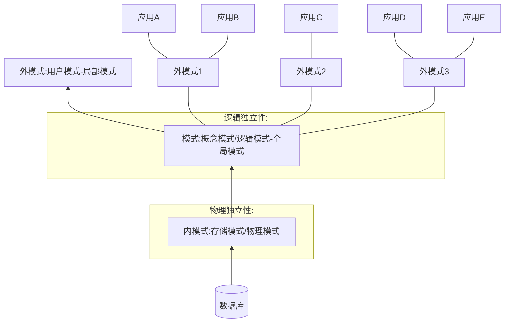

# 基础知识

## 数据库概念定义

1. *数据*(==data==)：数据库中存储的基本对象，描述事物的符号记录。

   + 种类（表现形式）：数字、文本、图形、图像、音频、视频等等——都可以经过数字化存入计算机。

   + *数据的含义*：数据的语义，数据与其语义是不可分的。

2. *数据库*(DataBase, ==DB==)：

   1. 数据库是具有一定结构的、相互之间有一定联系的数据的有序集合。

   2. 数据库是长期存储在计算机内、有组织的、可共享的大量数据的集合。数据库中的数据按一定的数据模型组织、描述和储存，具有较小的冗余度(redundancy)、较高的数据独立性(date independency)和易拓展性(scalability)，并可为各种用户分享——数据库数据具有**永久存储、有组织和可共享**三个基本特点。

3. *数据库管理系统*(DataBase Management System, ==DBMS==)：是一组系统程序，负责数据库的定义、管理、使用及操作维护

   > 数据库管理系统和操作系统一样是计算机的基础软件

   + 功能：

     1. 数据定义功能：

        DBMS提供数据定义语言(Date Definition Language，==DDL==)：对数据进行定义

     2. 数据组织、存储和管理：

        实现数据之间的联系；目标是提高存储空间利用率和方便存取。

     3. 数据操纵功能：

        DBMS提供数据操纵语言(Data Manipuliation Language，==DML==)：对数据进行操作（数据已经存在，增删改查）

        > DBMS提供数据控制语言(Data Control Language，==DCL==)：控制谁可以操作数据（收发权限）

     4. 数据库的事物管理和运行管理

     5. 数据库的建立和维护功能

     6. 其他功能

4. ***数据库系统***(DataBase System，==DDS==)简称为数据库

   数据库系统是由数据库、数据库管理系统（及其应用开发功能）、应用程序和数据库管理员(DataBase Administrator，DBA)组成的存储、管理、处理和维护数据的系统。

+ 数据管理技术的历史：
  
  1. 人工管理
  2. 文件系统
  3. 数据库系统 ：数据不是依赖处理过程的附属品，而是现实世界中独立存在的对象
  
  | 背景和特点           | 人工管理阶段           | 文件系统阶段             | 数据库系统阶段                                             |
  | -------------------- | ---------------------- | ------------------------ | ---------------------------------------------------------- |
  | 应用背景             | 科学计算               | 科学计算、数据管理       | 大规模数据管理                                             |
  | **硬件背景**         | 无直接存取存储设备     | 磁盘、磁鼓               | 大容量磁盘、磁盘阵列                                       |
  | **软件背景**         | 没有操作系统           | 有文件系统               | 有数据库管理系统                                           |
  | **处理方式**         | 批处理                 | 联机实时处理、批处理     | 联机实时处理、分布处理、批处理                             |
  | ==数据的管理者==     | 用户（程序员）         | 文件系统                 | 数据库管理系统                                             |
  | 数据面向的对象       | 某个应用程序           | 某个应用                 | 现实世界（一个部门、企业、跨国组织等）                     |
  | ==数据共享程度==     | 无共享，冗余度极大     | 共享性差，冗余度大       | 共享性高，冗余度小                                         |
  | ==**数据的独立性**== | 不独立，完全依赖于程序 | 独立性差                 | 具有高度的物理独立性和一定的逻辑独立性                     |
  | 数据的结构化         | 无结构                 | 记录内有结构、整数无结构 | 整体结构化，用数据模型描述                                 |
  | 数据控制能力         | 应用程序自己控制       | 应用程序自己控制         | 有数据库管理系统提供数据安全性、完整性、并发控制和恢复能力 |
  

## 数据库抽象概念

定义：对现实世界数据特征的抽象

+ 型（type）  ：对某一类数据的结构和属性的说明。
+ 值（value）：型的一个具体赋值。

> 关系数据库的型称关系数据库模式：是对关系数据库的描述
>
> 关系数据库的值称关系数据库		：是关系模式在某一时刻对应的集合

+ 模式（schema） ：是数据库中全体数据的逻辑结构和特征的描述。
+ 实例（instance）：模式的一个具体值。

> **抽象与具体**的不同叫法

1. 概念模型（信息模型）：

   + 实体（entity）     ：客观存在并可相互区别的事物
   + 属性（attribute）：实体所具有的某一特性
   + 码（key）              ：唯一标识实体的属性集
   + 实体型（entity type）：实体名及其属性名集合来抽象和刻画同类实体
   + 联系（relationship）  ：一对一、一对多、多对多

   表示方法：实体-联系方法，简称E-R方法，用于E-R图，也称E-R模型

2. 逻辑模型：

   1. 1. 层次模型 格式化模型 数据结构：树 

      2. 网状模型 格式化模型 数据结构：图

      始点 双亲节点 终点 子女节点

   3. 关系模型：

      + 关系(relation)     ：一个关系对应一个表
      + 元组(tuple)/记录 ：表的一**行**即为一个元组
      + 属性(attribute)   ：表的一**列**即为一个属性，列头即为*属性名*
      + 码(key)/码键：
      + 域(domain)：是一组具有相同数据类型的值的集合，属性的来自
      + 分量：元组中的一个属性值。一个小格格的内容
      + 关系模式：对关系的描述，表示为：`关系名（属性1， 属性2，……，属性n）`

      关系必须规范化：

      1. 每个分量必须是一个不可分的数据项

      | 关系术语   | 一般表格的术语             |
      | ---------- | -------------------------- |
      | 关系名     | 表名                       |
      | 关系模式   | 表头（表格的描述）         |
      | 关系       | （一张）二维表             |
      | 元组       | 记录或行                   |
      | 属性       | 列                         |
      | 属性名     | 列名                       |
      | 属性值     | 列值                       |
      | 分量       | 一条记录中的一个列值       |
      | 非规范关系 | 表中有表（大表中嵌有小表） |

   4. 面向对象数据模型

   5. 对象关系数据模型

   6. 半结构化数据模型

3. 物理模型：

**数据库系统结构**

+ 1. 内部的系统结构：三级模式结构   提供两级映像功能
  2. 外部的系统结构：单用户结构、主从式结构、分布式结构等。

+ 组成要素：
  1. 数据结构：描述数据库的组成对象以及对象之间的联系
  2. 数据操作：对数据库中各种对象（型）的实例（值）允许执行的操作的集合，包括操作及有关的操作规则是对系统动态性的描述
  3. 数据的完整性约束条件：一组完整性规则

**三级模式结构**：由内模式、模式、外模式三级构成，前后模式映像

​						   映像是模式之间的关系，图中虽是圈上模式，但表达的是与上层模式的关系

+ 模式（schema）（也称逻辑模式）：是数据库中全体数据的逻辑结构和特征的描述，是所有用户的公共数据视图。

  > 它是数据库系统模式结构的中间层，既不涉及数据的物理存储细节和硬件环境，又与具体的应用程序、所使用的应用开发工具及高级程序设计语言无关

1. 外模式（external schema）：也称子模式（subschema）或用户模式，它是数据库用户（包括应用程序员和最终用户）能够看见和使用的局部数据的逻辑结构和特征的描述，是数据库用户的数据视图，是与某一个应用有关的数据的逻辑表示
2. 内模式（internal schema）：也称存储模式（storage），一个数据库只有一个内模式，它是数据物理结构和存储方式的描述，是数据在数据库内部的组织方式。

+ 二级映像功能：保证数据库系统中的数据能够具有较高的逻辑独立性和物理独立性。

1. 外模式/模式映像：

   模式与外模式的对应是一对多的。

   当模式改变时，通过调整映像，使数据的外模式的应用程序不必修改，即数据的*逻辑独立性*。

2. 模式/内模式映像：

   内模式和模式的对应是一对一的。

   当内模式（存储结构）改变时，通过改变映像，可以使模式不变，继而使应用程序不必改变，即数据的*物理独立性*。

**数据库系统组成**

1. 硬件平台及数据库：存储软件和数据以及通信。
2. 软件：数据库管理系统、操作系统、开发程序的编译器，开发工具、应用。
3. 人员：管理、分析、设计制作、用户

# 关系数据库

+ 1. 关系是一个表               ——值
  2. 关系模式是关系的描述——型
  3. 关系模型由**关系数据结构、关系操作集合、关系完整性约束**组成

## 关系数据结构

对于一个二维表，域就是列，笛卡尔积就是行的**所有可能**，关系就是。

1. 域（domain）：域是一组具有相同数据类型的值的集合

2. 笛卡尔积（cartesian product）：笛卡尔积是域上的一种集合运算

   

   每个域的每个分量拿出来，多个域，这么组合在一起就是一个元组——全排列
   
3. 关系（relation）：关系是笛卡尔积的有限子集。

   

   关系是优先级和，不满足交换律——如果作为关系数据结构，需要限定和扩充。

   + 属性（attribute）：为区分相同的域而为其起的ID。

   + 候选码(candidate key)/码、键：关系中的某个属性组的值能够唯一地标识一个元组，而其子集不能，则称该属性组为候选码。

     > 每个候选码可以不止一个属性，组合起来起到”最小标识“的作用即可

   + 主码（primary key）：若一个关系有多个候选码，则选定其中一个为主码。

     > 同理，主码也可不止一个属性，但是这些属性在一个候选码中，是关联的。

   + 主属性（prime attribute）：候选码地诸属性。

   + 非主属性（non-prime attribute）或非码属性（non-key attribute）：不包含在任何候选码中的属性。

   + 全码(all-key):在最简单的情况下，候选码只包含一个属性。在最极端的情况下，关系模式的所有属性是这个关系模式的候选码。

   > 定义上关系可以是无限集合，但是在数据库系统中是无意义的

   + 外部码(Foreign Key)/外键：不是本关系的码，但是和另一个关系的主码相对应
   
   **关系的类型**：
   
   1. 基本关系（基本表或基表）：实际存在的表，它是实际存储数据的逻辑表示；
   
      性质：
   
      1. 列是同质的（homogeneous），即每一列中的分量是同一类型的数据，来自同一个域。
      2. 不同的列出自同一个域，称其中的每一列为一个属性，不同的属性要给予不同的属性名。
      3. 列的顺序无所谓，即列的次序可以任意交换，由于列顺序是无关紧要的，因此在许多实际关系数据库产品中增加新属性时，永远是插至最后一列。
      4. 任意两个元组的候选码不能取相同的值。
      5. 行的顺序无所谓，即行的次序可以任意交换。
      6. 分量必须取原子值，即每个分量都必须是不可分的数据项。
   
   2. 查询表：查询结果对应的表；
   
   3. 视图表：有基本表或其他视图表导出的表，是虚表，不对应实际存储的数据。

+ **关系模式**

  要求必须规范化(normalization)：要求关系必需满足一定的规范条件
  
  + 关系的每一个分量必须是一个不可分的数据项——不允许表中有表
  
  > 规范化的关系简称为*范式*(Normal form, NF)
  
  + 关系模式(relation schema)：关系的描述；可表示为：$R(U, D, DOM, F)$：
  
    其中R为关系名，U为组成该关系的属性名集合，D为U中属性所来自的域，DOM为属性向域的映像集合（说明属性来自什么域），F为属性间数据的依赖关系集合。
  
    关系模式可简记为$R(U)$或$R(A_1：D_1, A_2:D_2, ..., A_n:D_n)$：其中R为关系名，$A_1, A_2, ..., A_n$为属性名，域名及属性向域的影响常常直接说明为属性的类型、长度，即D；n是关系的度
  
  + 关系是关系模式总理某一时刻的状态或内容。关系模式是静态的、关系是动态的。

## 关系操作集合

1. 操作的对象和结果都是集合，也称*一次一集合*(set-at-a-time)的方式

   > 非关系数据模型的数据操作方法则是一次一记录(record-at-a-time)的方式

2. 操作操纵：——关系代数：用对关系的运算来表达关系操纵的形式化语言：**执行顺序：由右向左**

   + 查询(query)：**基本的**、扩展的
     + **选择**(select)：	   |$\sigma$ 筛选行

     + **投影**(project)：     |$\pi$ 取出列（自动去重）

     + 连接(join)：           |$\underset{条件}{\bowtie}$ 按条件合成新表

       + 自然连接：     ||$\bowtie$ 笛卡儿积后公共属性对应相等的元组的公共属性列并去重
       + 外连接：自然连接后会有根本没用到，外连接就是对这些也要
         + 左外连接：左边的不符合要求的也要
         + 右外连接：右边的不符合要求的也要

     + 除(divide)：          |$\div$ 

       + $R \div S$

         + 属性$X$对应的**像集**$Y$：每个X有哪几个Y，构建一个X是合并同类项，右边是它所有对应Y的二列表

         1. 找出共同关系
         2. 找出R的不同关系
         3. 找出R中不同关系对共同关系的像集
         4. 看哪个不同关系有所有共同关系的对应（二列表中哪个左边X 的 右边Y 里有全部共同关系）
         5. 取出这些不同关系即为结果

     + **并**(union)：          |$\cup$ 增

     + **差**(except)：         |$-$ 删

     + 交(intersection)：|$\cap$ 合成新表

     + **笛卡尔积**：            |$\times$
   + + 插入(insert)  ：      |通过并
     + 删除(delete) ：      |通过差
     + 修改(update)：      |
     
   + + 更名：                    |$\rho$ 用法：${\rho}_{新关系}(关系（结果）)$ 里外列数要一致：将新关系名字赋给处理的关系，其属性名也一一修改

   >运算的三大要素：运算对象、运算符、运算结果

   + 约束的表示

     + 实体完整性——主键
       $$
       关系R\\
       M_1 = {\rho}_{M_1(新的属性名)}(R)\\
       M_2 = {\rho}_{M_2(同上属性名)}(R)\\
       {\sigma}_{M_1.主键 = M_2.对应主键 \land M_1.除键外的任意列 \not = M_2.对应的列}(M_1 \times M_2) = \empty\\
       {\sigma}_{M_1.除键外的任意列 \not = M_2.对应的列}(M_1 \underset{M_1.主键 = M_2.对应主键}{\bowtie} M_2) = \emptyset
       $$

     + 参照完整性——外键
       $$
       参照关系R，被参照关系S：R的X是外键，对应S的Y\\
       {\pi}_{X}(R) \subseteq {\pi}_{Y}(S) \cup \empty
       $$

3. 语言：要求”关系完备性“

   早期的关系操作能力通常用关系代数方式或逻辑方式来表示（抽象）

   + 关系代数(relationalalgebra)：用对关系的运算来表达查询要求

     ege:ISBK

   + 关系演算(relational calculus)：用谓词来表达查询要求

     + 元组关系演算：谓词变元的基本对象是元组变量

       ege:ALPHA、QUEL

     + 域关系演算    ：谓词变元的基本对象是    域变量

       ege:QBE

   + 结构化查询语言(Structured Query Language, SQL):查询、数据定义、数据控制功能

     集查询、数据定义语言、数据操纵语言和数据控制语言(Date Control Language, DCL)于一体的关系数据语言

     高度非过程化，不用关心硬件实现

### LaTex

|                      | 渲染结果                                                | 代码                                    | 含义       |
| -------------------- | ------------------------------------------------------- | --------------------------------------- | ---------- |
|                      | $\emptyset$                                             | `emptyset`                              |            |
| 字符加标注           | $\hat{x} \ \overline{x} \ \dot{x}$                      | `\hat{x} \overline{x} \dot{x}`          | 固定符号   |
|                      | $\overset{\frown}{a}$  $\underset{A \theta B}{\bowtie}$ | `\overset{副}{主}`和`\underset{副}{主}` | 一个方案   |
|                      | $\sum\limits_{k = 1}^{n}{k}$                            | `\limits_`或`\limits^`                  | 另一个方案 |
| 布尔代数             | $\vee、\lor$；$\wedge、\land$                           | `\lor` `\land`                          |            |
|                      | $\in$ $\owns$                                           | `\in` `\owns`                           |            |
|                      | $\subset$ $\subseteq$ $\supset$ $\supseteq$             | `\subset \subseteq \supset \supseteq`   |            |
| 比较运算符$\theta$   | $\gt \ge \lt \le \ne $                                  | `\gt \ge \lt \le \ne`                   |            |
|                      | $\theta$                                                | `\theta`                                |            |
| **集合运算符**       | $\cup$                                                  | `\cup`                                  | 并         |
|                      | $-$                                                     | `-`                                     | 差         |
|                      | $\cap$                                                  | `cap`                                   | 交         |
|                      | $\times$                                                | `\times`                                | 笛卡儿积   |
| **专门的关系运算符** | $\sigma$                                                | `\sigma`                                | 选择       |
|                      | $\Pi$                                                   | `\Pi`                                   | 投影       |
|                      | $\bowtie$                                               | `\bowtie`                               | 连接       |
|                      |                                                         |                                         | 外连接     |
|                      |                                                         |                                         | 左外连接   |
|                      |                                                         |                                         | 右外连接   |
|                      | $\div$                                                  | `\div`                                  | 除         |
|                      | $\rho$                                                  | `\rho`                                  | 更名       |

### 关系代数

关系代数中，这些运算经过有限次复合后形成的表达式称为*关系代数表达式*。

+ 传统的集合运算：二目

  > 设关系$R$和关系$S$具有相同的目$n$（即两个关系都有$n$个属性），且相应的属性取自同一个域，$t$是元组变量，$t \in R$表示$t$是$R$的一个元组

  + 并(union)：关系$R$与关系$S$的并记作$R \cup S = \{t|t \in R \lor t \in S\}$其结果仍为$n$目关系，由属于$R$或属于$S$的元组组成

  + 差(except)：关系$R$与关系$S$的差记作$R - S = \{t|t \in R \land t \notin S\}$其结果关系仍为$n$目关系，由属于$R$而不属于$S$的所有元组组成

  + 交(intersection)：关系$R$与关系$S$的交记作$R \cap S = \{t|t \in R \land t \notin S\}$其结果关系仍为$n$目关系，由既属于$R$又属于$S$的元组组成。

    关系的交可以用差来表示，即$R \cap S = R - (R - S)$

  + 笛卡儿积(extended cartesian product)：两个分别为$n$目和$m$目的关系$R$和$S$的笛卡儿积是一个$(n + m)$列的元组的集合。元组的前$n$列是关系$R$的元组，后$m$列是关系$S$的一个元组，若$R$有$k_1$个元组，$S$有$k_2$个元组，则关系$R$和关系$S$的笛卡儿积有$k_1 \times k_2$个元组。记作$R \times S = \{t_rt_s | t_r \in R \land t_s \in S\}$，结果列合并，元组一一组合

+ 专门的关系运算：

  > + 设关系模式$R(A_1, A_2, ···, A_n)$，它的关系设为$R$。$t \in R$表示$t$是$R$的一个元组。$t[A_i]$则表示元组$t$中相应于属性$A_i$的一个分量
  > + 若$A = \{A_{i1}, A_{i2}, ···, A_{ik}\}$，其中$A_{i1}, A_{i2}, ···, A_{ik}$是$A_1, A_2, ···, A_n$中的一部分，则A称为属性列或属性组。$t[A] = \{ t[A_{i1}], t[A_{i2}], ···, t[A_{ik}]\}$表示元组$t$在属性列$A$上诸分量的集合，$\overline{A}$则表示$\{A_1, A_2, ···, A_n\}$中去掉$\{A_{i1}, A_{i2}, ···, A_{ik}\}$后剩余的属性组
  > + $R$为$n$目关系，$S$为$m$目关系。$t_r \in R$，$t_s \in S$，$\overset{\frown}{t_rt_s}$称为元组的*连接*(concatemation)或元组的串接。它是一个$n + m$列的元组，前$n$个分量为$R$从的一个$n$元组，后$m$个分量为S中的一个$m$元组。
  > + 给定关系$R(X, Z)$，$X$和$Z$为属性组。当$t[X] = x$时，$x$在$R$中的*象集*(images set)定义为$Z_x = \{t[Z] | t \in R, \ t[X] = x\}$它表示$R$中属性组$X$上值为$x$的诸元组在$Z$上分量的集合

  + 选择(selection)/限制(restriction)：在关系$R$中选择满足给定条件的诸元组，记作${\sigma}_F(R) = \{t | t \in R \land F(t) = '真'\}$ 其中F表示选择条件，同时一个逻辑表达式，取逻辑值”真“或“假”。

    逻辑表达式$F$的基本形式为$X_1 \theta Y_1$ 其中$\theta$是比较运算符，$X_1$，$Y_1$等是属性名、或为常量、或为简单函数；属性名也可以用它的序号来代替。在基本的选择条件上可以进一步进行逻辑运算

    选择运算实际上是从关系$R$中选取使逻辑表达式$F$为真的元组（行的角度）。

    + 使用：${\sigma}_{con}(R)$ —— 筛选行

  + 投影(projection)：关系$R$上的投影是从$R$选择出若干属性列组成新的关系，记作${\Pi}_A(R) = \{ t[A] | t \in R \}$ 其中$A$为$R$中的属性列

    投影操作是从列的角度进行的运算。

    可能取消某些元组：重复行。

    + 使用：${\Pi}_{B_1, B_2, ..., B_n}(R)$ —— 取出列

      ​        ：${\Pi}_{带列名表达式}(R)$ —— 取出列的同时并对列的值做计算

  + 更名：`\rho`

    + 使用：${\rho}_{R'(A_1, A_2, ..., A_n)}(R)$ —— 修改关系名或关系中的列的名
  
  + 连接(join)/$\theta$连接：从两个关系的笛卡儿积中选取属性间满足一定条件的元组，记作 $R \underset{A \theta B}{\bowtie} S= \{\overset{\frown}{t_rt_s}|t_r \in R \land t_r[A] \theta t_s[B]\}$ 其中$A$和$B$分别为$R$和$S$上列数相等且可比的属性组，$\theta$是比较运算符。连接运算从$R$和$S$的笛卡儿积$R \times S$中选取$R$关系在$A$属性组上的值与$S$关系在$B$属性组上的值满足比较关系$\theta$的元组
  
    + 等值连接(equijoin)：$\theta$为“=”的连接运算符称为等值连接。它从关系R与S的广义笛卡尔积中选取A、B属性值相等的那些元组，记为$R \underset{A = B}{\bowtie} S = \{\overset{\frown}{t_rt_s}|t_r \in R \land t_r[A] = t_s[B]\}$ 
  
    + 自然连接(natural join)：特殊的等值连接，要求两个关系中进行比较的分量必须是同名的属性组，并且在结果中把重复的属性列去掉。记作$R \underset{A = B}{\bowtie} S = \{\overset{\frown}{t_rt_s}[U - B]|t_r \in R \land t_r[A] = t_s[B]\}$ 其中属性组$B$为$R$和$S$中具有相同的属性组，$U$为$R$和$S$的全体属性集合。
  
      其中不存在相等或者没有同名的元组会被舍弃，被称为*悬浮元组*(dangling tuple)
  
      1. 外连接(outer join)：把悬浮元组也保存在结果关系中，在其属性上填空值NULL。
      2. 左外连接(left outer join或left join)：只保留左边关系R中的悬浮元组
      3. 右外连接(right outer join或right join)：只保留右边关系R中的悬浮元组
      
      符号冒头
  
  + 除运算(division)：设关系$R$除以关系$S$的结果为关系$T$，则$T$包含所有在$R$但不在$S$中的属性及其值，且$T$的元组与$S$的元组的所有组合都在$R$中。
  
    用象集定义除法：给定关系$R(X,Y)$和$S(Y,Z)$，其中$X、Y、Z$为属性组。$R$中的$Y$与$S$中的$Y$可以有不同的属性名，但必须来自相同的域集。$R$与$S$的除运算得到一个新的关系$P(X)$，$P$是$R$中满足下列条件的元组的$X$属性列上的投影；元组在$X$上分量值$x$的象集$Y_x$包含$S$在$Y$上投影的集合，记作$R \div S = \{t_r[X] | t_r \in R \land {\Pi}_Y(S) \subseteq Y_x \}$ 其中$Y_x$为$x$在$R$中的象集，$x = t_r[X]$。

-----

## 关系完整性约束

关系模型中有三类完整性约束：实体完整性(entity integrity)、参照完整性(referential integrity)和用户定义的完整性(user-defined integrity)；前两者是必须的，被称为*关系的两个不变性*

+ 实体完整性：每个元组都应该是可区分的、是唯一的——主码

  + 规则：若属性（指一个或一组属性）A是基本关系R的主属性，则A不能取空值(null value)。**所谓空值就是”不知道“或”不存在“或”无意义“的值。**

    + 针对基本关系

    + 现实世界中实体可区分，具有某种唯一性标识

      关系模型中以主码作为唯一性标识

    + 主码中的属性即主属性不能取空值

+ 参照完整性：                                                                ——外码

  + 定义：设$F$是基本类型$R$的一个或一组属性，但不是关系$R$的码，$K_s$是基本关系$S$的主码。如果$F$与$K_s$相对应，则称$F$是$R$的*外码*(foreign key)，并称基本关系$R$为*参照关系*(referencing relation)，基本关系$S$为*被参照关系*(referenced relation)或*目标关系*(target relation)。关系R和关系S不一定是不同的关系。

    $R(K_r, F, ···)$                                     $S(K_s, ···)$

    ​      参照关系                ->             被参照关系（目标关系）

  + 规则：若属性（或属性组）$F$是基本关系$R$的外码，它与基本关系$S$的主码$K_s$相对应（基本关系$R$和$S$不一定是不同的关系），则对于$R$中的每个元组在$F$上的值必须：

    + 或者取空值（F的每个属性值均为空值）；
    + 或者等于S中某个元组的主码值

+ 用户定义的完整性
