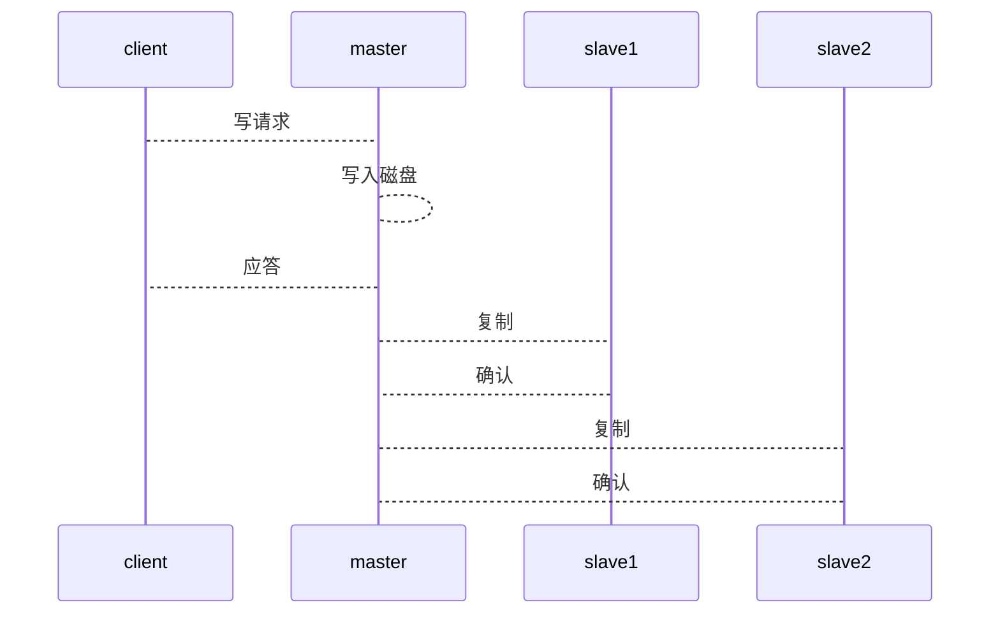
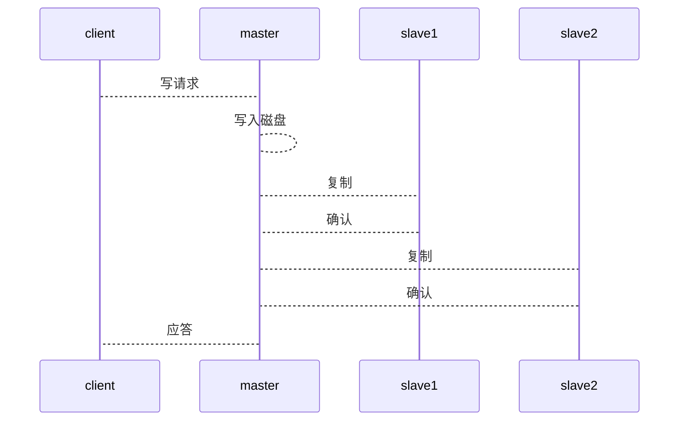

+ Ref：
    + [OpenACID Blog · 可靠分布式系统-paxos的直观解释](https://blog.openacid.com/algo/paxos/)

>数据库领域中也有"一致性"的概念，但它是ACID（原子、一致、隔离和持久）中的一个，与分布式系统领域下的一致性概念不同。

+ 意义

    分布式系统的一致性问题最终都会归结为分布式存储的一致性问题。

    而几乎所有的分布式存储系统都使用某个“冗余”的方式。

    而冗余的基础就是**多副本**策略；

    而副本之间的一致性就需要一致性算法保证。

# 以往鉴来

## 主从异步复制

问题在于在client收到应答与数据真的写入集群所有成员的磁盘中有gap。

## 主从同步复制

当副本相关机器全部应答之后才应答给客户端，代价就是性能以及加入有成员宕机，则服务不可用。

## 主从半同步复制

是同步和异步之间的折中。

即在master应答client之前，将数据复制到**足够多**的机器上（但不需要是全部）。

这样副本足够多，可以保证比较高的可靠性；且少量机器的宕机也不会让整个系统不可用（停止写入）

问题：假如master宕机，且没有任何一个slave有完整数据，则出现了某种不一致。

## 多数派读写

继续改良

每次写，必须保证写入到**半数以上**的机器，
每次读，必须检查读取有**半数以上**的机器是否有。

此时的问题是什么？

假如写是改呢？
会从不同的机器读取到不同的值。

解决：
每次写入带上一个全局的、单调递增的**时间戳**。
此时就有能力识别最新的了。

但是还存在某种场景
第一次写入完成多数写
第二次写入没有完成（即写入了，但是是少数）
此时再读会出现从多数读到的数据的时间戳更晚，仍然不一致。