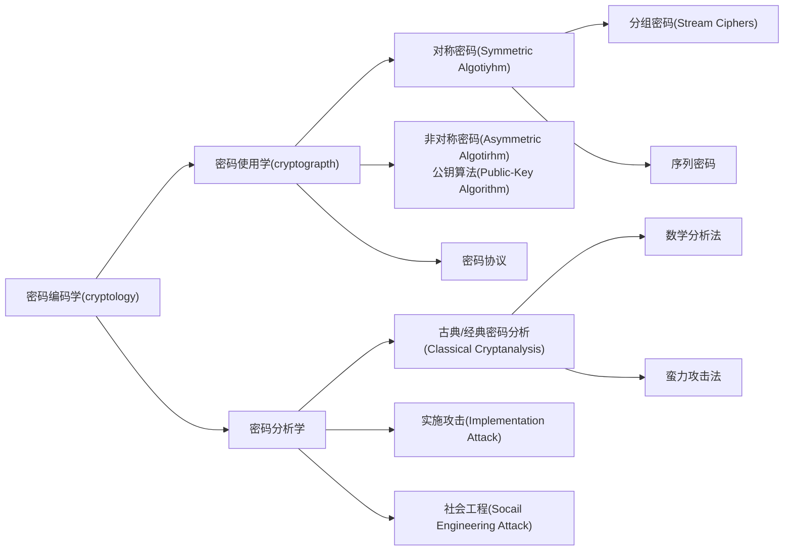

```mermaid
graph LR;
root["密码编码学(cryptology)"]
lson["密码使用学(cryptograpth)"]
rson["密码分析学"]

root --> lson
root --> rson

sam1["对称密码(Symmetric Algotiyhm)"]
sam2["非对称密码(Asymmetric Algotirhm)<br>公钥算法(Public-Key Algorithm)"]
sam3["密码协议"]

lson --> sam1
lson --> sam2
lson --> sam3

new1["分组密码(Stream Ciphers)"]
new2["序列密码"]

sam1 --> new1
sam1 --> new2

son1["古典/经典密码分析(Classical Cryptanalysis)"]
son2["实施攻击(Implementation Attack)"]
son3["社会工程(Socail Engineering Attack)"]
le1["数学分析法"]
le2["蛮力攻击法"]

rson --> son1
rson --> son2
rson --> son3
son1 --> le1
son1 --> le2
```

+ **Kerckhoffs原理**：即使除密钥外的整个系统的一切都是公开的， 这个密码体制也必须是安全的；尤其是即使攻击者知道系统的加密算法和解密算法，此系统也必须是安全的。
	>算法一般是公开的，虽然算法不公开更有利于保密，但是算法是未被测试的算法，把其公开更有利于对其分析