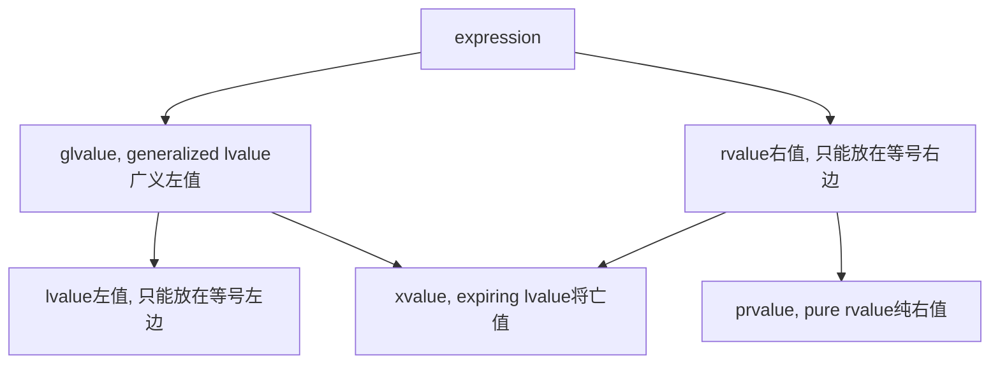

+ Reference：
	+ [Everything about Rvalue Reference](https://www.zhihu.com/question/363686723/answer/1976488046?utm_campaign=&utm_medium=social&utm_oi=1517839223738114049&utm_psn=1690447606109749249&utm_source=qq)

## 值类别和右值引用

+ 区分值类别value category和值类型value type，前者是下面要讨论的，后者则是与引用类型reference type相对而言的。
	>这里有歧义，也有说值类型值得是表达式类型，比如基础类型fundamental type和复合类型compound type



+ 左值：有标识符、可取地址的表达式，可绑定到`T&`，其中常量只能绑定到常左值引用const lvalue reference
+ 纯右值：没有标识符、不可以取地址的表达式，即临时对象
	+ C++11之前：只能绑定到常左值引用，而不能绑定到非常左值引用non-const lvalue reference
	+ C++11之后：还可以使用右值引用`T&&`，右值引用同样可以有cv限定符，但一般不用
		+ 一个绑定了右值的变量是左值，因为它是可以取地址的。
		+ 延长生命周期：一个prvalue临时对象会在包含这个临时对象的完整表达式估值完成后、按生成顺序的逆序被销毁，除非有生命周期延长发生。如果一个 prvalue 被绑定到一个引用上，它的生命周期则会延长到跟这个引用变量一样长。

+ 将亡值：返回类型为对象的右值引用的函数调用或者重载运算符表达式，转换为对象的右值引用类型的转型表达式
	+ 还记得右值的生命周期延长么？它对xvalue是无效的。

|          | glvalue  |          |        |
| -------- | -------- | -------- | ------ |
| 不可移动 | lvalue   |          |        |
| 可移动   | xvalue   | prvalue  | rvalue |
|          | 有标识符 | 无标识符 |        |

## 实现移动语义的类标准函数最佳实现

[另一个笔记](Programing-Language/Modern-C++/OOP-misc.md#移动强异常安全惯用法)

## 移动语义在函数返回时的默认表现

+ 返回值优化named return value optimization, NRVO，即将返回对象直接构造在调用者的栈上，在C++11之后，返回值优化仍然可能发生，在没有的情况下，编译器也会首先试图将本地对象移动出去而不是拷贝，且这个过程不需要手工用`std::move`干预，甚至反而会影响。
	+ 这个还造成一个反直觉的东西，即使对象不可拷贝和移动，同样可以通过返回值返回，因为它直接在对应为找构造，没有拷贝和移动。

《C++核心指南》的F.20提到：函数返回尽量使用返回值而不是通过参数
>通过参数进行“大”的数据对象的返回是旧的用法，因为它直接上性能更高（似乎更少拷贝）

但是在现代C++中，对应函数返回值的接收，还是函数返回的过程，都有充分的优化。

+ Mark一个概念：Semiregular半正则对象

## 引用折叠/坍缩和完美转发
Reference Collapsing引用折叠/坍缩

### 转发引用/万能引用
forwarding reference转发引用，曾经叫universal reference万能引用或者通用引用

>在遇到`T&&`时，一定是右值引用嘛？

对于函数：
```cpp
template<typename T>
void foo(T&& param);
```

+ 传入左值，则`T`匹配成类型引用，则参数列表是`type& &&`，此时折叠成`T&`，是左值引用
+ 传入右值，则`T`匹配成类型，则参数列表是`type&&`，是右值引用

所以在`T&&`作为模板参数是，主要作用是保持值类别进行转发。

+ 什么场景有`T`有`&&`但不是转发引用呢？
	+ 比如`std::vector<T>&&`，这里的`T`的推导没有歧义
	+ 如果多了一个`const`比如`foo(const T&& ...);`它也不是，只是右值引用
	+ 还有就是模板类方法，虽然参数有`T`，但是它可能在类定义时就确定了。

### `std::move`和`std::forward`

两者不移动也不转发任何东西，它们仅仅是做cast转换

+ `std::move`：无条件的将参数转换成右值
	+ `... foo(const std::strin& s) { std::string s2(std::move(s)); ...}`：这里仍然是拷贝，因为`std::move`的返回值是通用引用，所以`std::move(s)`的类型是`const std::string&&`，哦吼？这个可不能匹配到移动构造，因为`const`不匹配。
+ `std::forward`：在特定情况下将参数转换成右值

# 奇技淫巧

+ effect提到一个奇技淫巧：
```cpp
std::multiset<std::string> names;       //全局数据结构

template<typename T>                    //志记信息，将name添加到数据结构
void logAndAdd(T&& name)
{
	auto now = std::chrono::system_clokc::now();
	log(now, "logAndAdd");
	names.emplace(std::forward<T>(name));
}
std::string nameFromIdx(int idx);   //返回idx对应的名字

void logAndAdd(int idx)             //新的重载
{
	auto now = std::chrono::system_clock::now();
	log(now, "logAndAdd");
	names.emplace(nameFromIdx(idx));
}
```

有大问题，对short，使用的是通用引用


来看魔法
```cpp
template<typename T>
void logAndAdd(T&& name)
{
	logAndAddImpl(
		std::forward<T>(name),
		std::is_integral<typename std::remove_reference<T>::type>()
	);
}
```

甚至这里不能用` std::is_integral<T>()`，因为tm`int&`不是interger

那么具体的实现呢？

tag dispatch,
这是模板元编程的标准构建模块

```cpp
template<typename T>                            //非整型实参：添加到全局数据结构中
void logAndAddImpl(T&& name, std::false_type)	//译者注：高亮std::false_type
{
	auto now = std::chrono::system_clock::now();
	log(now, "logAndAdd");
	names.emplace(std::forward<T>(name));
}
std::string nameFromIdx(int idx);           //与条款26一样，整型实参：查找名字并用它调用logAndAdd
void logAndAddImpl(int idx, std::true_type) //译者注：高亮std::true_type
{
  logAndAdd(nameFromIdx(idx)); 
}
```

但是这只能有两个分支呀

`std::enable_if`可以给你提供一种强制编译器执行行为的方法
