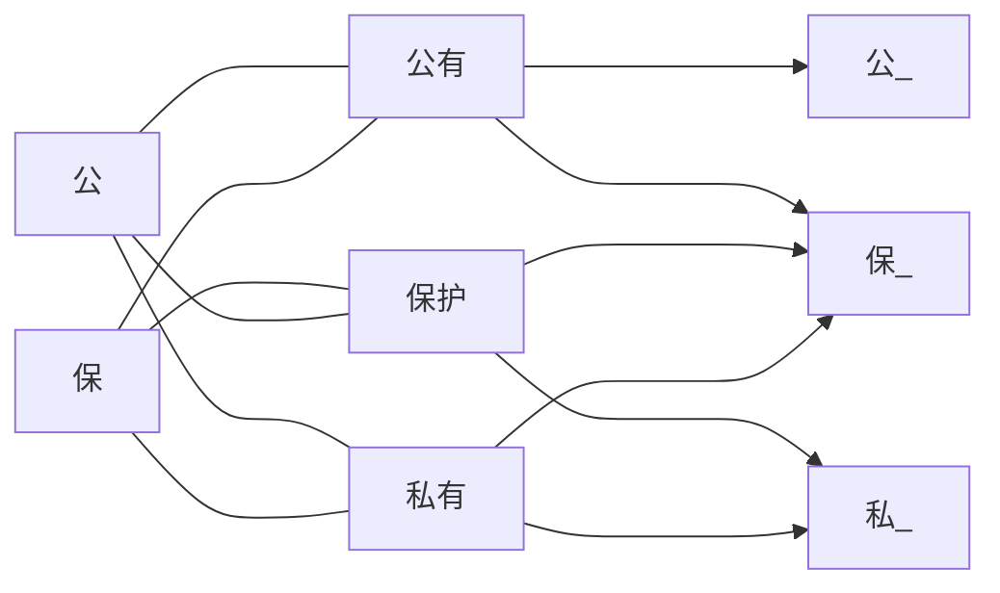

# 类的关系-继承

+ C++定义了类的关系范式并提供语法实现

  | 关系模型  | 属性                    | 语法                                                         |
  | --------- | ---------------- | --------------------------------------- |
  | is-a关系  | 是：香蕉是水果   | 公有继承                                                  |
  | has-a关系 | 有：律师有大脑 | 包含组合层次化<br />私有继承保护继承 |

  其他比较

  | 说明             | is-a关系                                                  | has-a关系                                                      |
  | ------------ | -------------------------------------- | ------------------------------------------- |
  | 基类方法归属 | 外界可以通过派生类对象调用基类方法 | 类内可以通过基类调用基类方法，类外不可以 |

  has-a关系不用语言体现的比较

  | 说明                                 | 包含组合层次化            | 私有继承      | 公有继承 |
  | ------------------------ | ---------------------- | ------------ | -------- |
  | 对于基类数据成员的操纵 | 通过基类对象调用方法 | 可以直接操纵 |              |

# 继承: 公有继承

+ 声明：
	```cpp
	class DerivedClass: 访问控制关键字 BaseClass {...};
	```

	+ 访问控制关键字：`public`、`protected`、`private`（默认）

+ 数据成员和成员函数访问控制变化：
  | 特征             | 公有继承             | 保护继承                 | 私有继承                                 |
  | ---------------- | -------------------- | ------------------------ | ---------------------------------------- |
  | 公有成员变成     | 派生类的公有成员     | 派生类的保护成员         | 派生类的私有成员(基类接口不是派生类接口) |
  | 保护成员变成     | 派生类的保护成员     | 派生类的保护成员         | 派生类的私有成员                         |
  | 私有成员变成     | 只能通过基类接口访问 | 只能通过基类接口访问     | 只能通过基类接口访问                     |
  | 能否隐式向上转换 | 是                           | 是（但只能在派生类类中） | 否                                       |



+ 私有成员无法传递
+ 有继承不影响
+ 保护继承归为保护成员类内无影响，类为无影响（本来也不能访问）
+ 私有继承将公有和保护成员归为私有，截断在继承链上的传递

## 基础知识

+ 标准函数：如果没有特殊的设计，**派生类**在调用标准函数时对基类数据成员部分的处理是通过**调用基类的标准函数**

  派生类无动态内存：派生类标准函数自动调用基类标准函数（来处理基类的动态内存）

  派生类有动态内存：派生类标准函数显式调用基类标准函数

  + 构造函数：派生类不能直接访问基类的私有成员，而必须通过基类方法进行访问——派生类构造函数必须使用基类构造函数。

    派生类对象时，程序必须先创建基类对象，从概念上说，这意味着基类对象应当在程序进入派生类构造函数之间被创建——而这时基类对象已经使用了默认构造函数——使用新语法：成员初始化列表语法

    ```cpp
    class baseClass{
        int num;
    public:
        baseClass(int num_) { num = num_; }
    }
    class drivedClass : public baseClass {
        int num;
        baseClass sam;
    public:
        drivedClass(int a, int b) : baseClass(b) { num = a; }				//调用基类的构造函数
        drivedClass(int a, const baseClass & b) : baseClass(b) { num = a;} 	   //调用基类的复制构造函数
    }
    ```

    + 创建对象时，**先调用基类构造函数**（初始化继承的数据成员），**再调用派生类构造函数**（初始化新增的数据成员）
    + 派生类的构造函数总是调用基类的构造函数，如果不使用成员初始化器列表，则调用其默认构造函数
    + 在继承链中，相邻的类通过调用关联的构造函数实现传递。
    + C++11新增几个构造函数的方式，默认不继承

  + 析构函数：

    + 派生类对象过期时，程序**首先调用派生类析构函数，然后再调用基类析构函数**。

  + 复制构造函数：

    + 派生类有动态内存：派生类复制构造函数可通过成员初始化处理基类数据

  + 赋值运算符：

    1. 派生类赋值基类，调用基类赋值运算符，参数为基类引用可指向派生类，可实现，派生类多余部分被忽略
    2. 基类赋值派生类，调用派生类赋值运算符，参数引用是派生类不能指向基类
       1. 派生类设计转换构造函数，将基类转换为派生类
       2. 派生类重载运算符，参数是基类

    + 派生类有动态内存：派生类赋值运算符需显式调用基类赋值运算符

      ```cpp
      drivedClass & operator=(drivedClass & t) {
          ...
          baseClass::operator(t);  //1
          *this = t; 				 //2
          ...
      }
      ```

      两种方式选一个。

+ 派生类和基类之间的**特殊关系**（引用兼容性属性）：
	+ 派生类可以使用基类的方法，条件是方法不是私有的。
	+ 基类指针/引用可以在不进行显式类型转换的情况下指向/引用派生类对象，但这样的基类只能使用派生类中的基类方法

		这个特性是单向，反过来不可以（派生类指向基类调用基类中的派生方法是滑稽的（基类有个屁的派生方法），而调用基类中的基类方法也是没必要的（本来就可以用））

	+ 基类引用定义的函数或指针参数可以用于基类对象或派生类对象。
	+ 将基类对象初始化为派生类对象（基类没有参数为派生类的构造函数，但有参数为基类的复制构造函数，其基类引用参数可以指向派生类，这样派生类作为参数然后被复制为基类（而复制的过程丢弃多余的数据成员））
	+ 可以将派生类赋值给基类对象（使用隐式重载赋值运算符，基类引用参数，返回基类对象）
	+ 基类指针数组，其指向的可能是多种类，这也是多态的一种。

	+   
		+ 派生类引用或指针转换为基类的引用或指针被称为*向上强制转换*（upcasting），规则是is-a关系的一部分，使得共有继承不需要进行显式类型转换。可在继承链上传递。因为对基类的任何操作对派生类也可以。
		+ 基类指针或引用转换为派生类的指针或引用被称为*向下强制转换*（downcasting）， is-a关系是不可逆的，所以需要显式转换是有风险的，相当于派生类放弃对多余特性的控制权。因为派生类有基类没有的操作。
		+ 隐式向上转换（implicit upcasting）

## 其他继承方式

保护继承

+ 对于保护部分，类外保护成员的行为与私有成员相似，对于派生类来说，保护成员的行为与公有成员相似

  即基类外边不能访问的，派生类可以当自己人访问

  但是有问题，如果这个保护类在基类中被设有只能通过公有方法修改方法，但是派生类可以直接修改，就违背的基类的意思。

私有继承

## 多态继承: 虚

派生类可以使用基类的方法，如果想同一个方法在基类和派生类的行为不同呢？公有继承的多态——**虚方法/虚函数**

+ 关键字`virtual`：添加在基类方法声明前(定义不需要)，该方法被定义为*虚方法*，派生类同名方法不需要关键字(但是建议使用)。

+ 通过引用类型或指针类型而不是对象调用方法：
	+ 非虚方法：根据引用类型或指针类型选择方法——可静态联编，通过类型确定调用类型。
	+ 虚方法：根据引用或指针指向的对对象的类型选择方法——对象指针数组一个for过去可能使用不同方法—多态。

+ (函数名)联编/绑定（binding）：将源代码中的函数调用解释为执行特定的函数代码块地址
	+ 静态联编(static binding ）  (早期联编early finding)：在编译工程中进行联编（函数重载通过名称修饰或名称矫正确定）
	+ 动态联编(dynamic binding)(晚期联编late finding)  ：在运行时进行联编（虚函数不知道具体使用的哪个）（run-time binding运行时绑定）

虚函数的动态联编：编译器处理虚函数的方法是给每个对象添加一个隐藏成员，其保存指向函数地址数组(虚函数表(virtual function, vtbl)：存储类的虚函数的地址，派生类重定义则添加新地址，否则添加基类函数地址)的指针。使用虚函数时：对象->隐藏指针->虚函数表->函数地址->运行函数。所以虚函数的**开销更大**（时空都有）

### override和final

这是两个上下文关键字，就是这两个关键字并不是不能用于自己的代码，它们只在特定的环境才是关键字。

当派生类的虚函数overriding重写基类的同名函数时，要求基类函数必须是`virtual`的，函数名、形参类型、常量性、引用限定符必须完全一样，返回值和异常说明必须兼容。我们看到要求颇多，很容易出错误，且编译器未必积极的检测，而关键字`override`则表示这段代码就是重写基类函数的，请严格的检查。

而`final`则表示该虚基类不能重写，如果用于类则表示该类不能被子继承。

## 抽象基类

>在is-a关系中，如果由椭圆继承出圆会有很多信息冗余，直接定义圆比继承更容易，但分别定义又忽略的两者的共同点

在考虑继承时，抽象出类的共性，将共性放在一个类中，这个类就是**抽象基类**(（abstract base class, ABC）：**至少有一个*纯虚函数*的类**)，然后从抽象基类中派生出其他类（具体(concrete)类）。这样就可以使用ABC的指针数组管理两个类实现多态。

+ 纯虚函数(pure virtual function)：未实现的函数
	+ 声明：在方法声明的末尾添加`=0`：`virtual type fName() = 0;` `virtual type fName() const = 0;`
	+ 含纯虚函数的类（抽象基类）不能创建其对象，只能作为基类。
	+ 纯虚函数没有定义，C++11允许为其定义，不过必须在类的外部

## 类作用域继承

## 标准函数继承

# has-a关系
>包含组合

## 虚基类

多重继承(multiple inheritance, MI)，多个基类由逗号分割，访问限定符限定每一个基类（默认私有）

如果不同基类具有同名成员，将基类指针或引用指向派生类是，需要强制转换确定使用那个基类，所以继承多态性很复杂，C++引入新技术：  
虚基类(virtual base class)

# nested class嵌套类

在另一类中声明的类。

+ 当嵌套类位于公有部分，可以在包含类外通过作用域解析运算符使用嵌套类。
+ 访问权限：类声明的位置决定类的作用域或可见性；类可见后，访问控制规则（公有、保护、私有、友元）将决定程序对嵌套类成员的访问权限。

+ 模板嵌套
+ 修改基类的访问权限：TODO

## 类型转换

+ 从派生类向基类的类型转换只针对指针或引用类型有效
+ 从派生类直接向基类赋值时（不是指针和引用），由于基类肯定有拷贝构造函数，这个函数可以接受派生类，但函数内部只处理基类部分的数据成员，相当于派生类部分的数据成员被sliced down了。
