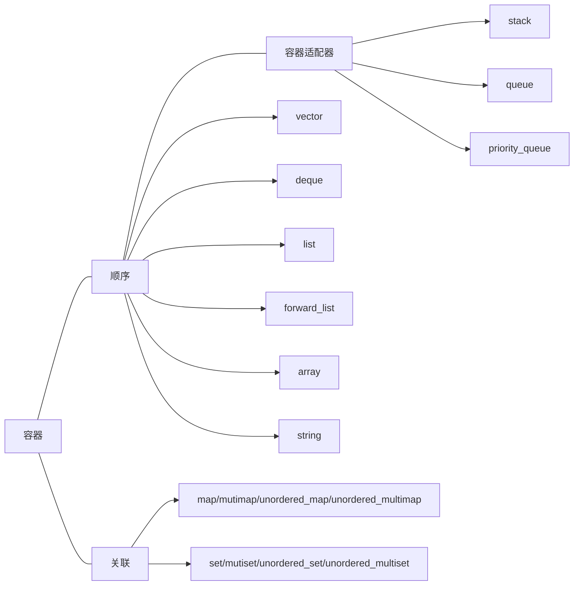

## string
[string lib ref](https://en.cppreference.com/w/cpp/string) | [basic_string](https://en.cppreference.com/w/cpp/string/basic_string)
>string是basic_string的特化版本，所以ref中没有string而是指向basic_string

+ 类型[`size_type`](https://en.cppreference.com/w/cpp/string/basic_string)，从ref中我们可以看到在传统C++中它是从Allocator中定义出来的，而那里是由`size_t`定义的，但是在Modern C++中，呃，它套娃下去我就看不懂了。

### 与C风格字符串的区别
可以把C语言的字符串看做整数数组，但是C++上的字符串则有重重封装

+ string类的末尾，C风格字符串的末尾是`'\0'`（注意这不是0，而是特殊的转义字符），在string类中使用[`npos`](https://en.cppreference.com/w/cpp/string/basic_string/npos)，
+ 头文件：string类是由`<string>`支持的，其他（`string.h`和`cstring`）都是支持C风格字符串相关操作的

# Container

+ `push_back`的强异常安全性，因为是首先全部copy过去，然后再手动析构，如果copy过程出现意外，后面的不会执行。

+ 容器适配器：stack和queue是基于deque实现的，priority_queue是在vector之上实现的。
	+ stack要求push_back、pop_back、和back：可用除array和forward_list之外的容器构造
	+ queue要求back、push_back、front、和 push_front：构造于list或deque之上，但不能用vector构造
	+ priority_queue处理上述还要随机访问能力：构造于vector或deque之上，但不能基于list

# Iterator
## 自定义迭代器的最佳实践

## 迭代器和分配器精髓是什么?

新手看msvc，老手看libstdc++