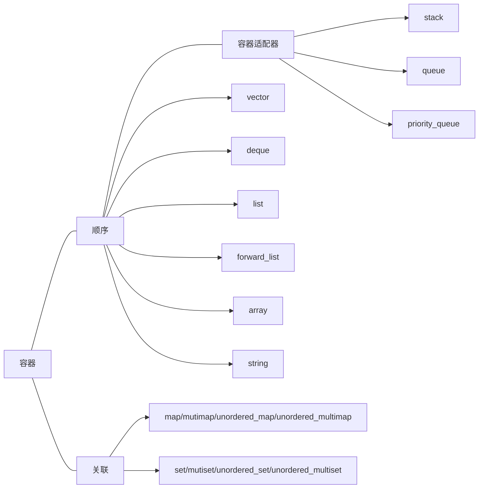

# Container

+ `push_back`的强异常安全性，因为是首先全部copy过去，然后再手动析构，如果copy过程出现意外，后面的不会执行。

+ 容器适配器：stack和queue是基于deque实现的，priority_queue是在vector之上实现的。
	+ stack要求push_back、pop_back、和back：可用除array和forward_list之外的容器构造
	+ queue要求back、push_back、front、和 push_front：构造于list或deque之上，但不能用vector构造
	+ priority_queue处理上述还要随机访问能力：构造于vector或deque之上，但不能基于list

# Iterator
## 自定义迭代器的最佳实践

## 迭代器和分配器精髓是什么?

新手看msvc，老手看libstdc++