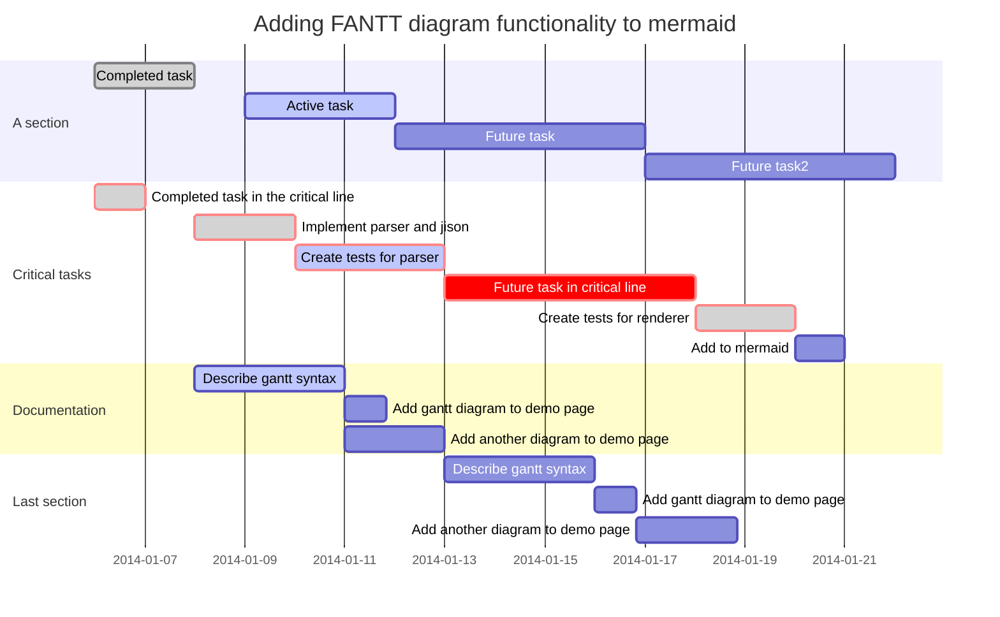
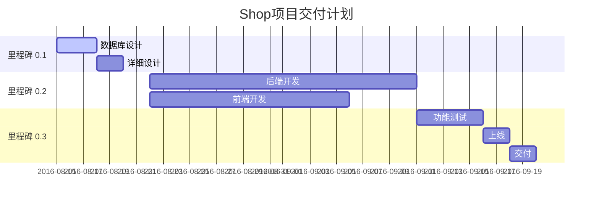

# 基本语法

+ makdown可内嵌HTML

+ 转义字符：字符前添加反斜杠字符(\\)或复写。

+ 很多地方都可格式化——强调、标亮和删除线及引用与代码块

参考文献：[markdown官方](https://markdown.com.cn)

+ 标题：

  若干”#“号加空格，几个井号就是几级标题

  > HTML:`<h1></h1> <h2></h2> <h3></h3> ……`

  ege：（zweix：往上看那个基本语法四个大字）

+ 标题编号：

  与标题相同的行上用大括号括起该自定义ID。

  > HTML:`<h1 id = ""></h1>`

  目录：通过创建带有数字符号（`#`）和自定义标题ID的标准链接，可以链接到文件中具有自定义ID的标题。

  格式：`[name（不一定跟链接标题一样）][id]`

  > HTML:`<a href="id">name</a>`

  ege：不常用，不举例。

+ 分割线：

  符号：星号（*）、破折号（-）或下划线

  单独一行三个或多个符号

  ---

+ 段落：

  回车分开

  > HTML:`<p></p>`

+ 换行：

  在一行的末尾添加两个或多个空格，然后按回车键

  > HTML:`<br>`

  ege：Typora似乎用不了。

+ 强调：

  符号：星号（*）或者下划线（_）（不推荐）

  | 强调               | Markdown     | HTML                |
  | ------------------ | ------------ | ------------------- |
  | 粗体               | 两侧两个星号 | `<strong></strong>` |
  | 斜体               | 两侧一个星号 | `<em></em>`         |
  | 以上两个强调可叠加 |              |                     |

  ege：这是**粗体**，这是*斜体*

+ 标亮：

  符号：等号（=）

  两侧两个等号

  ege：这是==标亮==

+ 删除线：

  符号：波浪线（~）

  两侧两个波浪线

  ege：这是~~删除~~

+ 引用：

  段落前\>加空格

  可自嵌套，可嵌套列表

  ege：只能单开一行。

  > 这是引用

+ 代码：

  + 单行代码：两端一个反引号（`）

    ​					转义反引号：两端两个反引号、

    `printf("Hello world");`

  + 多行代码：围栏式代码块，首位三个反引号

    ​					Typora自动询问语言和自动填充
    
    ```py
    print("Hello world")
    ```

+ 列表：

  + 有序列表

    每列表前添加数字后接英文句点加空格，其实从1起

    > HTML:
    >
    > ```html
    > <ol>
    > 	<li></li>
    > 	<li></li>
    > 	.
    > 	.
    > 	.
    > </ol>
    > ```
    >
  
+ 无序列表
  
  每列表前添加星号（*）、加号（+）、破折号（-）（不推荐）加空格
  
  > HTML:
    >
    > ```html
    > <ul>
    > 	<li></li>
    > 	<li></li>
    > 	.
    > 	.
    > 	.
    > </ul>
    > ```
    >
  
  缩进可嵌套列表，

  可嵌套引用

  ege：如上。

+ 链接：

  链接文本放在中括号内，链接地址放在后面的括号中，链接title可选，它放在圆括号中链接地址后面，跟链接地址之间以空格分隔。

  超链接Markdown语法代码：`[超链接显示名](超链接地址 "超链接title")`

  对应的HTML代码：`<a href="超链接地址" title="超链接title">超链接显示名</a>`

  ---

  网址和Email地址简单的变链接：使用尖括号可以很方便地把URL或者email地址变成可点击的链接。

  ---

  引用类链接：

  1. `[name][num]`
  2. `[num]:链接或地址`

  ----

  ege：文首连接。

+ 注脚：

  注脚位置添加`[^id]`，无空白

  结尾对应添加`[^id]:内容`

+ 图像：

  要添加图像，请使用感叹号 (`!`), 然后在方括号增加替代文本，图片链接放在圆括号里，括号里的链接后可以增加一个可选的图片标题文本。

  插入图片Markdown语法代码：`.md/图片链接 "图片title")`。

  对应的HTML代码：``

  > 本地图片 链接为 位置\名

+ 表格：

  要添加表，请使用三个或多个连字符（`---`）创建每列的标题，并使用管道（`|`）分隔每列。您可以选择在表的任一端添加管道。

  您可以通过在标题行中的连字符的左侧，右侧或两侧添加冒号（`:`），将列中的文本对齐到左侧，右侧或中心。

# LaTex

+ 换行

  1. `\\`
  2. `\par`：缩进——typore不行
  3. 以`\\`换行，并在对齐位置和新行开头使用`&`来对齐

+ [参考文献](https://math.meta.stackexchange.com/questions/5020/mathjax-basic-tutorial-and-quick-reference)

+ LaTex数学公式代码块：

  1. 单行：`$...$`或`$$...$$`

+ 空格：

  | 123         | 123      |
  | ----------- | -------- |
  | $a\;b$      | `\;`     |
  | $a\quad b$  | `\quad`  |
  | $a\qquad b$ | `\qquad` |

+ 括号：

  1. 大括号`{}`，可用于分隔块，及不同位置的表达式。故真正引用大括号使用反斜杠的转义序列。
  2. 不同层级的大括号——`\Biggl(\biggl(\Bigl(\bigl((x)\bigr)\Bigr)\biggr)\Biggr)`: $\Biggl(\biggl(\Bigl(\bigl((x)\bigr)\Bigr)\biggr)\Biggr)$ 

  | 括号                | 代码                       |
  | ------------------- | -------------------------- |
  | $(x)$               | `()` 或 `\left(...\right)` |
  | $[x]$               | `[]`                       |
  | $\{x\}$             | `\{\}`                     |
  | $|x|$               | `|` 或 `\vert`             |
  | $\Vert x \Vert$     | `\Vert`                    |
  | $\langle x \rangle$ | `\langle...\rangle`        |
  | $\lceil x \rceil$   | `lceil...\rceil`           |
  | $\lfloor x \rfloor$ | `\lfloor...\rfloor`        |

+ 希腊字母：

  首字母大写使用对应大写形式

  | 显示                  | 代码     |
  | --------------------- | -------- |
  | $\alpha$ $\Alpha$     | \alpha   |
  | $\beta$ $\Beta$       | \beta    |
  | $\gamma$ $\Gamma$     | \gamma   |
  | $\delta$ $\Delta$     | \delta   |
  | $\epsilon$ $\Epsilon$ | \epsilon |
  | $\zeta$ $\Zeta$       | \zeta    |
  | $\eta$ $\Eta$         | \eta     |
  | $\theta$ $\Theta$     | \theta   |
  | $\iota$ $\Iota$       | \iota    |
  | $\kappa$ $\Kappa$     | \kappa   |
  | $\lambda$ $\Lambda$   | \lambda  |
  | $\mu$ $\Mu$           | \mu      |
  | $\nu$ $\Nu$           | \nu      |
  | $\xi$ $\Xi$           | \xi      |
  | $\pi$ $\Pi$           | \pi      |
  | $\rho$ $\Rho$         | \rho     |
  | $\sigma$ $\Sigma$     | \sigma   |
  | $\tau$ $\Tau$         | \tau     |
  | $\upsilon$ $\Upsilon$ | \upsilon |
  | $\phi$ $\Phi$         | \phi     |
  | $\chi$ $\Chi$         | \chi     |
  | $\psi$ $\Psi$         | \psi     |
  | $\omega$ $\Omega$     | \omega   |
  | $\ell$                | `\ell`   |

+ 特殊符号：

  1. 正无穷：`\infty` : $\infty$;

+ 上标：`^`；下标：`_`

  ege：`x_i^2` : $x_i^2$

  ​		  `\log_2 x` : $\log_2 x$

+ 分数：使用时可结合块（`{}`）分隔各部分

  | 表达式           | 代码             |
  | ---------------- | ---------------- |
  | $\frac{x}{y}$    | `\frac{x}{y}`    |
  | $\cfrac{x}{y}$   | `\cfrac{x}{y}`   |
  | 或者             |                  |
  | ${a+1\over b+1}$ | `{a+1\over b+1}` |

+ 数对：使用时结合块

  | 表达式                                  | 代码                                    |
  | --------------------------------------- | --------------------------------------- |
  | ${n+1 \choose 2k}$ 和 $\binom{n+1}{2k}$ | `{n+1 \choose 2k}` 或 `\binom{n+1}{2k}` |

+ 运算符

  | 运算符    | 代码       |
  | --------- | ---------- |
  | $+$       |            |
  | $-$       |            |
  | $\times$  | `\times`   |
  | $\div$    | `\div`     |
  | $\pm$     | `\pm`      |
  | $\mp$     | `\mp`      |
  | $a\mod b$ | `a \mod b` |
  | $\bmod$   | `\bmod`    |
  | $\cdot$   | `\cdot`    |
  | 省略号    |            |
  | $\ldots$  | `\ldots`   |
  | $\cdots$  | `\cdots`   |

+ 微积分表达式：

  | 符号        | 代码        |
  | ----------- | ----------- |
  | $\sum$      | `\sum`      |
  | $\int$      | `\int`      |
  | $\iint$     | `\iint `    |
  | $\iiint$    | `\iiint`    |
  | $\prod$     | `\prod`     |
  | $\bigcup$   | `\bigcup`   |
  | $\bigcap$   | `\bigcap`   |
  | $\idotsint$ | `\idotsint` |

  极限：

  | 表达式 | 代码   |
  | ------ | ------ |
  | $\lim$ | `\lim` |
  | $\sin$ | `\sin` |

  箭头：https://blog.csdn.net/Artoria_QZH/article/details/103310704

  | 表达式            | 代码                   |
  | ----------------- | ---------------------- |
  | $\to$             | `\to`<br>`\rightarrow` |
  | $\leftarrow$      | `leftarrow`            |
  | $\leftrightarrow$ | `\leftrightarrow`      |
  | $\Rightarrow$     | `\Rightarrow`          |
  |                   | `up down Up Down `     |

+ 关系运算符

  | 关系运算符  | 转义序列    |
  | ----------- | ----------- |
  | $\lt$       | `\lt`       |
  | $\gt$       | `\gt`       |
  | $\le$       | `\le`       |
  | $\leq$      | `\leq`      |
  | $\leqq$     | `\leqq`     |
  | $\leqslant$ | `\leqslant` |
  | $\ge$       | `\ge`       |
  | $\geq$      | `\geq`      |
  | $\geqq$     | `\geqq`     |
  | $\geqslant$ | `\geqslant` |
  | $\neq$      | `\neq`      |

+ 集合运算符

  | 集合运算符    | 转义序列      |
  | ------------- | ------------- |
  | $\cup$        | `\cup`        |
  | $\cap$        | ` \cap`       |
  | $\setminus$   | `\setminus`   |
  | $\subset$     | `\subset`     |
  | $\subseteq$   | ` \subseteq`  |
  | $\subsetneq$  | `\subsetneq`  |
  | $\supset$     | `\supset`     |
  | $\in$         | `\in`         |
  | $\notin$      | `\notin`      |
  | $\emptyset$   | ` \emptyset`  |
  | $\varnothing$ | `\varnothing` |

-----

# mermaid

参考文献：[简书博客](https://www.jianshu.com/p/77cc07f47cdc)

## 流程图

+ 结构：

  ```
  graph 方向;
  /*
  subgraph 外框名字/子图内容
  一个块 连线 另一个块
  ...
  end
  */
  一个块 连线 另一个块
  ...
  ```

+ 说明：

  + 方向：用两个字母表示从哪到哪，一个图只能有一个方向

    | 字母 | T    | B      | D    | L    | R     |
    | ---- | ---- | ------ | ---- | ---- | ----- |
    | 含义 | top  | botton | down | left | right |

  + 节点：`id(content)`没有空格，其中括号格式可改

    | 形状   | 符号                 | 拓展                                               |
    | ------ | -------------------- | -------------------------------------------------- |
    |        | `(圆角矩形)`         | `((圆形))`                                         |
    | 四边形 | `[矩形]`<br>`{菱形}` | `[/平行四边形/] [\\] [/\] [\/]`<br>`>旗帜] [旗帜<` |
    |        |                      | `([圆边矩形])`、                                   |
    | 六边形 | `{{六边形}}`         |                                                    |
    | 子流程 | `[[]]`               |                                                    |
    | 数据库 | `[()]`               |                                                    |

  + 连线

    | 类型     | 代码                  |
    | -------- | --------------------- |
    | 有无箭头 | `---`直线 `--->`箭头  |
    | 是否虚线 | `-.-`                 |
    | 插入文字 | `--文字--` `-.文字.-` |

    + 可相互结合
    + 箭头中的`-`越多越长

## 泳道图

## 饼图

巨简单，占比自动算

+ 语法结构：

  ```
  pie
  	title 图名
  	"项1" : 其量
  	"项2" : 其量
  	...
  	"项n" : 其量
  ```

## 甘特图




